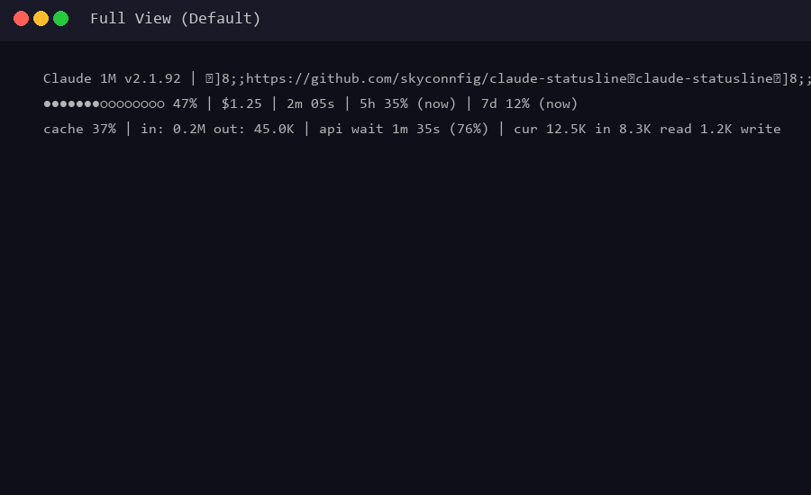
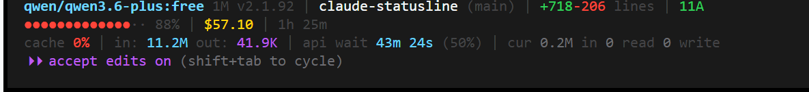

# Claude Code Statusline

> A beautiful, information-rich statusline script for [Claude Code](https://claude.ai/code) CLI.
>
> [](LICENSE)
> [](https://www.gnu.org/software/bash/)
> [](https://jqlang.org/)
> [](#output-formats)

Displays 3 lines of real-time session information:

```
Claude 200K v2.1.92 | project (main) | +342 -87 lines | executor | NOR
●●●●●●●●●●○○○○○ 47% | $1.25 | 2m 05s | 5h 35% (2h 30m) | 7d 12% (5d 12h)
cache 37% | in: 202.1K out: 45.0K | api wait 1m 35s (76%) | cur 12.5K in 8.3K read 1.2K write
```

## Screenshots

### Demo GIF



### Screenshot



### Format Previews

**Full Format:**
```
Claude 200K (main) | +342 -87 lines | executor | NOR
●●●●●●●○○○○○○ 47% | $1.25 | 2m 05s | 5h 35% | 7d 12%
cache 37% | in: 202.1K out: 45.0K | api wait 1m 35s (76%)
```

**Compact Format:**
```
Claude (main) | $1.25 | 2m 05s | 47% | +342 -87 | executor
```

**ASCII Format:**
```
Claude 200K (main) | +342 -87 lines | executor | NOR
|||||||:::::::: 47% | $1.25 | 2m 05s | 5h 35% | 7d 12%
cache 37% | in: 202.1K out: 45.0K | api wait 1m 35s (76%)
```

**Bare Format:**
```
Claude 200K (main) | +342 -87 lines | executor | NOR
..........::::: 47% | $1.25 | 2m 05s | 5h 35% | 7d 12%
cache 37% | in: 202.1K out: 45.0K | api wait 1m 35s (76%)
```

## Features & Output Formats

| Format | Command | Description |
|--------|---------|-------------|
| **Full** | (default) | 3-line detailed view with all metrics |
| **Compact** | `--format compact` | Single condensed line for narrow terminals |
| **ASCII** | `--format ascii` | 3-line view with pure ASCII characters (no Unicode) |
| **Bare** | `--format bare` | 3-line plain text, no colors or escape sequences |

```
Full:
Claude 200K (main) | +342 -87 lines | executor | NOR
●●●●●●●●●○○○○○○ 47% | $1.25 | 2m 05s | 5h 35% | 7d 12%
cache 37% | in: 202.1K out: 45.0K | api wait 1m 35s (76%)

Compact:
Claude (main) | $1.25 | 2m 05s | 47% | +342 -87 | executor

ASCII:
Claude 200K (main) | +342 -87 lines | executor | NOR
|||||||:::::::: 47% | $1.25 | 2m 05s | 5h 35% | 7d 12%
cache 37% | in: 202.1K out: 45.0K | api wait 1m 35s (76%)
```

### Color Coding

- **Green** (< 50%): Healthy usage
- **Yellow** (50%–80%): Moderate usage — getting close
- **Red** (> 80%): High usage — consider compacting

### Git Stats

- `3M` — 3 modified files
- `2A` — 2 added/untracked files
- `1D` — 1 deleted file

### Context Bar Progressions

```
Low usage (green):          ●●○○○○○○○○○○○○○ 15%
Moderate usage (yellow):    ●●●●●●●○○○○○○○● 47%
High usage (red):           ●●●●●●●●●●●●●●● 92%
```

## Quick Install

```bash
curl -fsSL https://raw.githubusercontent.com/skyconnfig/claude-statusline/main/statusline.sh \
  -o ~/.claude/scripts/statusline.sh && \
mkdir -p ~/.claude/scripts && \
bash ~/.claude/scripts/statusline.sh --init
```

That's it! Restart Claude Code and you'll see the statusline.

## Manual Installation

### Step 1: Download

```bash
git clone https://github.com/skyconnfig/claude-statusline.git
```

Or copy `statusline.sh` to your preferred location:

```bash
mkdir -p ~/.claude/scripts
cp statusline.sh ~/.claude/scripts/
```

Make it executable (Linux/macOS):

```bash
chmod +x ~/.claude/scripts/statusline.sh
```

### Step 2: Configure

**Automatic (recommended):**

```bash
bash statusline.sh --init
```

**Manual:** Edit `~/.claude/settings.json`:

```json
{
  "statusLine": {
    "type": "command",
    "command": "bash ~/.claude/scripts/statusline.sh"
  }
}
```

**Windows (Git Bash):**

```json
{
  "statusLine": {
    "type": "command",
    "command": "bash /c/Users/YourName/.claude/scripts/statusline.sh"
  }
}
```

### Step 3: Restart Claude Code

## How It Works

Claude Code passes session metadata as JSON on stdin. The script parses it with `jq`, formats it with ANSI colors, and outputs 3 lines.

```
Claude Code ──JSON──> statusline.sh ──ANSI text──> Terminal status bar
```

## Prerequisites

- `bash` (Git Bash on Windows)
- `jq` — JSON parser (`choco install jq` on Windows)
- `git` — for branch and file stats
- `awk` — for token formatting (included in most systems)

## Configuration

### Using a different shell path

```json
{
  "statusLine": {
    "type": "command",
    "command": "/usr/bin/bash /path/to/statusline.sh"
  }
}
```

### Disabling the statusline

Remove the `statusLine` key from `settings.json`, or set:

```json
{
  "disableAllHooks": true
}
```

## Troubleshooting

### Statusline not showing

1. Verify `jq` is installed: `which jq`
2. Test the script manually:
   ```bash
   echo '{"model":{"display_name":"Test"},"workspace":{"current_dir":"/tmp"},"cost":{"total_cost_usd":0,"total_duration_ms":0},"context_window":{"used_percentage":10}}' | bash statusline.sh
   ```
3. Check `settings.json` for valid JSON syntax

### Colors not rendering

Ensure your terminal supports ANSI escape sequences and is not set to `TERM=dumb`. Try `--format bare` for plain text.

### Rate limits / 5h / 7d not showing

These fields are only present when rate limit data is provided by Claude Code. They appear when you are approaching your usage limits.

## JSON Input Schema

```json
{
  "model": { "display_name": "Claude" },
  "workspace": { "current_dir": "/path/to/project" },
  "cost": {
    "total_cost_usd": 1.25,
    "total_duration_ms": 125000,
    "total_api_duration_ms": 95000,
    "total_lines_added": 342,
    "total_lines_removed": 87
  },
  "context_window": {
    "used_percentage": 47,
    "context_window_size": 200000,
    "total_input_tokens": 202100,
    "total_output_tokens": 45000,
    "current_usage": {
      "input_tokens": 12500,
      "cache_read_input_tokens": 8300,
      "cache_creation_input_tokens": 1200
    }
  },
  "rate_limits": {
    "five_hour": { "used_percentage": 35, "resets_at": 1743915600 },
    "seven_day": { "used_percentage": 12, "resets_at": 1744174800 }
  },
  "version": "2.1.92",
  "vim": { "mode": "NORMAL" },
  "agent": { "name": "executor" }
}
```

## License

MIT

---

Made by [skyconnfig](https://github.com/skyconnfig)
